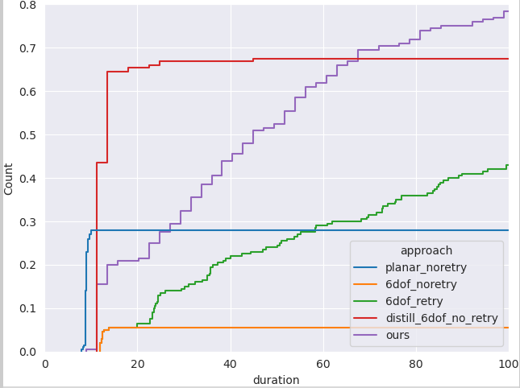

# Extending

This document contains more in-depth code-base information, tutorials, and tips and tricks for those who are looking to extend our framework.


# I want to add more

## Robotic Utilities ⚒️

## Robots 🤖

Cross-embodiment learning is cool.
To study this, you will need to add more robots.

You have to check out the [MuJoCo Menagerie](https://github.com/deepmind/mujoco_menagerie).
The UR5 and RealSense models were modified from their models, and there are so many other cool robots to add.

If you are only interested in using a different gripper, you can checkout `UR5WSG50Finray` and `UR5Robotiq` to see how to handle robot control.
Meanwhile, the models need to be added in the environment class, and you can check out `MujocoUR5WSG50FinrayEnv` and `MujocoUR5Robotiq85fEnv` to see how to handle dynamic imports of robot grippers.

Make sure you correctly define `end_effector_links`, and correctly define the collision mesh for your end effector links.
They are used in `get_grasped_obj_id` to check for grasp success.
You may also need to tune `ee_action_num_grip_steps` in `EnvConfig` so that the grasp checker results are correct.

## Assets 🪑

In creating the benchmark, I use:
 - [Blender](https://www.blender.org/) to model some of my own assets, like the mailbox 📫
 - [Mujoco Scanned Objects](https://github.com/kevinzakka/mujoco_scanned_objects) by [Kevin Zakka](https://kzakka.com/). Big shout out to him for all his amazing open-source work, go give him a few stars ⭐
 - [SketchFab](https://sketchfab.com/): The source for some of the highest quality models I know. Some work is needed to modify them for MuJoCo (see below).


**What you can use**.
A notable asset source which will be interesting to incorporate is [Objaverse](https://objaverse.allenai.org/).
You should check it out if you want to add more assets.

### Tools & Scripts 📜

Given an `.obj` file as an asset's visual mesh, you'll need to create a collision mesh.
I use [V-HACD](https://github.com/kmammou/v-hacd) for approximate convex decomposition of the visual mesh, and include them in my `.xml` files.
Although I prefer to do this manually, there is a [tool](https://github.com/kevinzakka/obj2mjcf) to automate this process which you might find useful.
I would verify every asset I add by running my grasping primitive on it
```sh
python scripts/benchmark_grasp_primitive.py
```

Just to verify it gets non-zero success rates.
If the robot fails to grasp all the time, it could be:
 - too big: use `scale` in MJCF's `.xml`.
 - too slippery: use `condim` and `friction` in MJCF's `.xml`.
 - bad collision mesh: try V-HACD with different settings. In the worse case, manually create your own collision meshes with Mujoco geometry primitives.

## Environments & Tasks 🌏

### New Simulators

Wouldn't it be cool to get rich, diverse, language-guided manipulation on deformables or fluids?

MuJoCo is amazing for rigid body simulation, but in my experience from [FlingBot](https://flingbot.cs.columbia.edu/), NVidia's simulators for cloth simulation is still the way to go.

The majority of the environment logic is already in the abstract base class `Env` in `scalingup/utils/core.py`.
To support a new simulator, you would extend this baseclass (see `MujocoEnv` for an example).
Some of the functionalities you'll need to implement include rendering (`render`, `get_rgb`), environment state parsing (`get_state`), control (`servol`), motion planning (`motion_plan_rrt`), code API (`get_exec_vars`, which allows LLMs to directly run code in your environment).

### New Tasks

**Custom Environment Dynamics for Robot Tool-Use**.
As described in the [codebase walkthrough](walkthrough.md), you can register callbacks, which I use for rendering, control handling, and observation collection.
You can also use it to handle custom dynamics (e.g., triggering something when a butter is pressed).
See `CatapultMujocoEnv` for an example.

## Language Models 🦙

When running the `ScalingUpDataGen` policy, you have the option to choose different OpenAI models.
The default configuration (`scalingup/config/policy/task_tree_inference/divide_and_conquer.yaml`) uses `text-davinci-003`.
You can try a different OpenAI language model arguments by modifying `policy.task_tree_inference.planner.api_config`.
For instance, to see how well `text-curie-001` does at a temperature of `0.6` for data generation in the mailbox domain 
```sh
python scalingup/inference.py evaluation.num_episodes=50000 policy=scalingup evaluation=mailbox policy.task_tree_inference.planner.api_config.engine=text-curie-001 policy.task_tree_inference.planner.api_config.temperature=0.6
```


To add support for a new language model, I would start from `scalingup/policy/llm_policy_utils.py`, which is where all calls to LLMs start.
You'll need to make sure it implements the `complete` method and you're all set!
```py
@classmethod
def complete(
    cls,
    prompt: str,
    api_config: GPT3APIConfig,
    numpy_random: np.random.RandomState,
    temperature: float = 1.0,
) -> GPT3Completion: ...
```

> ❗ **Caution**
> 
> Numpy random states are passed into `complete()` to ensure full determinism.
> Your language model should use it to seed completion.
> For instance, it can create a [`torch.Generator`](https://pytorch.org/docs/stable/generated/torch.Generator.html) from the Numpy random state.

# Figure Utilities 🖼️

## Efficiency Plot

To see how well your policy's success rates improve with more time
```sh
python scripts/efficiency_plot.py
```

which will generate a plot that looks like this



How I created this figure in the paper was by importing an SVG version of this figure into figma, then doing all my design (fonts, colors) in there.

## Visualizing Language-conditioned Outputs

The goal of this figure is to convey interesting language-conditioned behavior, so different domains require different initial starting configurations.
For the drawer domain, the robot should be at a configuration which is ambiguous to all drawers, such that when prompted with the corresponding language input, the policy will output actions specific to that input.
Similarly, for the catapult domain, the robot should have the cube at a position which *could* be any of the three tasks.

To achieve this, I manually set MuJoCo's configuration `qpos` after creating the environment.
To reproduce the figure, set the correct checkpoint path, then run
```sh
python scripts/visualize_multimodal_output.py
```
This will output `.ply` files with vertex colors based on the jet colormap. 
I will import and visualize the predicted actions in Blender using this [point cloud visualization tool](https://github.com/uhlik/bpy).

# Development Tips ✅

### Hydra 🐉

All experiment configuration (data generation, environment creation, policy set up) are done using `yaml` files with `hydra`.
This allows me to:
 - **Track all hyperparameters**: This is a game changer when I revisit a set of a few hundred experiments 3 months later and forgot what hyperparameters I have swept over.
   - This is done in `setup()` (`scalingup/utils/generic.py`), where I flatten the configuration and pass it into the `WandbLogger`.
 - **Compose configs**: My data generation policy approaches are identical with only a few small changes. The baseline data generation policies (`scalingup_no_success_retry` and `scalingup_no_success_retry_planar`) inherits from the main `ScalingUpDataGen` policy (`scalingup/config/policy/scalingup.yaml`), modifying only `retry_until_success`, `action_primitive_mode`, and `planar_primitive_only`.

Understanding the codebase's configuration setup is crucial to understanding the codebase, so I highly recommend being fluent with [Hydra](https://hydra.cc/docs/intro/).
 
### Headless Rendering 📷

If you're running large scale experiments on a headless server, you can install [VirtualGL](https://www.virtualgl.org/) to enable headless GPU rendering.
Otherwise, you can force MuJoCo to use CPU rendering by setting the `MUJOCO_GL=osmesa` environment variable.

### Multi-processing 🖧

I use [`ray`](https://www.ray.io/) to handle all multi-processing.
Sometimes, ray instantiated actors/tasks won't run immediately because their default CPU affinity is null or all in one/two cores.
To ensure ray actors use, for example, the first 64 CPU cores on your machine
```sh
for x in $(pgrep -u $(whoami)); do taskset -pc 0-63 $x; done
```

### Typing 👩‍👦‍👶

Most of the code-base has type annotations,
This enables type checking with tools like [`mypy`](https://mypy-lang.org/) to allow easier development and debugging in a large code-base.
I *highly highly* recommend using some form of static type checker.


In this project, I've set up [pre-commit](https://pre-commit.com/) hooks for formatting (using [black](https://github.com/psf/black)), linting (using [flake8](https://flake8.pycqa.org/en/latest/)), static type checking (using [mypy](https://mypy-lang.org/)), and typo-checker (using [codespell](https://github.com/codespell-project/codespell), extremely helpful for writing typo-free markdowns, comments, and prompts).
To enable them and keep them updated
```sh
pre-commit install && pre-commit autoupdate
```
To validate types and data values during runtime, I also use [Pydantic](https://docs.pydantic.dev/latest/) dataclasses.

Some of these tools can be annoying when you just want to do a quick dirty git commit but I have found that it helps a lot in the long run.

> The emoji I chose for typing is meant to mean inheritance 👩‍👦‍👶.
> If you have an idea for a better emoji to use, please submit a pull request

### Profiling ⏱️

My favorite speed profiler is [`line_profiler`](https://github.com/pyutils/line_profiler) which gives line-by-line timing stats.
A typical output might look like this

```
Line #      Hits         Time  Per Hit   % Time  Line Contents
==============================================================
 1375       5903689.8    4293.6          57.8%   self.control_buffer.get_interpolated_joint_ctrl(t=self.time, robot=self.robot)
```
To find bottlenecks, I usually just look at `% Time`.


### Data Format 💽

I've done extensive sweeps of all data formats to find the best trade-off between disk space and compression/decompression speed.
I've tried pickle and zarrs, and various backends and compressors, and opted for LMDB backed zarr files with the `blosclz` compressor.
If you change what kind of data is stored in each trajectory, you'll want to rerun the evaluations to find the best configuration for your data
```sh
python scripts/eval_compressors.py
```

> 📘 **Info**
> 
> [LMDB](http://www.lmdb.tech/doc/) databases are [sparse files](https://en.wikipedia.org/wiki/Sparse_file) in Unix.
> This is fine at the OS level, because it can handle memory-mapping.
> However, tools like `rsync` and `scp` are not aware of `lmdb`'s sparseness. 
> This means if you try to `rsync` a `mdb` file from one computer to another, it will try to send *the entire 1TB* of null bytes.
> I recommend compacting them with `mdb_copy`.
> You might find this one-liner useful!
> ```sh
> find files -name "*.mdb" | xargs -n1 -P16 -I% mdb_copy -c -n % compact_%
> ```

### RAM Usage 💾

When collecting a long control trajectory, with lots of images for both the policy's observation and for visualization, the memory costs of each frame adds up.
I use in-memory `Blosc` compression of depth and RGB frames to cut down on these costs (see definition for `VisionSensorOutput`).

# Known Issues 💀

## Memory Leak 💾

Unfortunately, I have not fully addressed all memory leaks in data generation.
My latest efforts are in `tests/test_memory_leaks.py`, which runs various functions on repeat and check memory usage.
To fully fix it, you can start there.


# Training Tips ✅

## Mixed-Precision

In my experience, naively using 16-bit training caused instability when training diffusion policies.
There are many tricks to stabilize this, but I have not dug further.