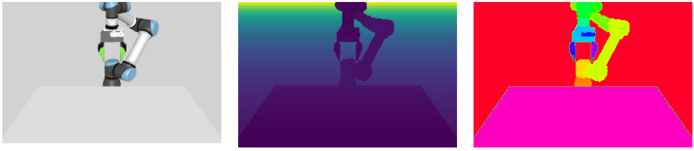
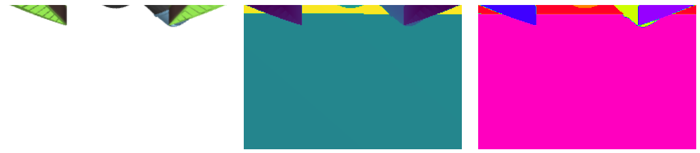

# Setup

Create the conda environment. I *highly* recommend using [Mamba](https://mamba.readthedocs.io/en/latest/installation.html), which is [faster](https://blog.hpc.qmul.ac.uk/mamba.html#:~:text=mamba%20is%20a%20re%2Dimplementation,Red%20Hat%2C%20Fedora%20and%20OpenSUSE), but if you insist on Conda, then replace `mamba` commands below with `conda`
```sh
mamba env create -f scalingup.yml
mamba activate scalingup
```

Then, in the repo's root, install the repo as a pip package
```sh
pip install -e .
```

Run a quick command to check that an empty table top environment can be loaded
```sh
python examples/render_table_top.py
```
This should show you RGB, depth, and segmentation masks for the front workspace and wrist mounted camera view.




> 📘 Info
> 
> If the rendered image comes up weird, maybe your setup does not support MuJoCo's default renderer (GLFW).
> You can try one of their other supported renderers (`osmesa`,`egl`) by setting the `MUJOCO_GL` environment variable (e.g., `MUJOCO_GL=osmesa`).
