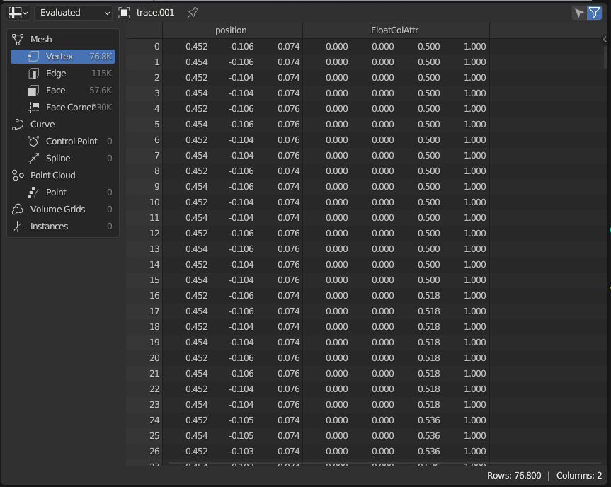
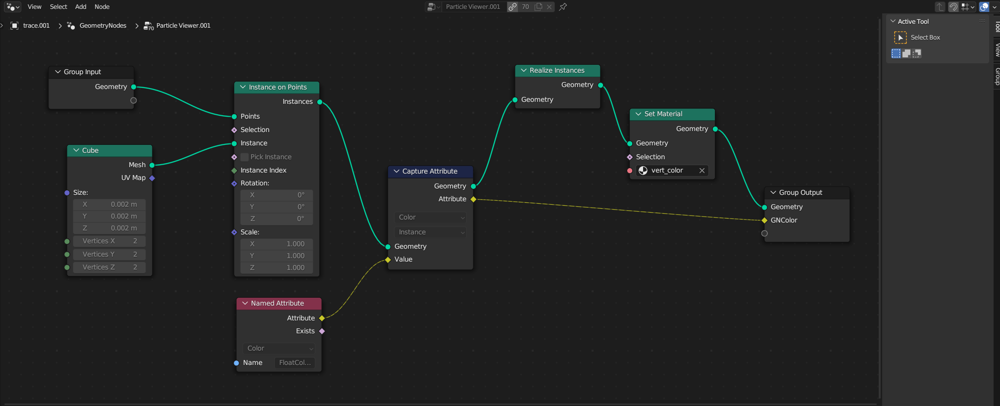
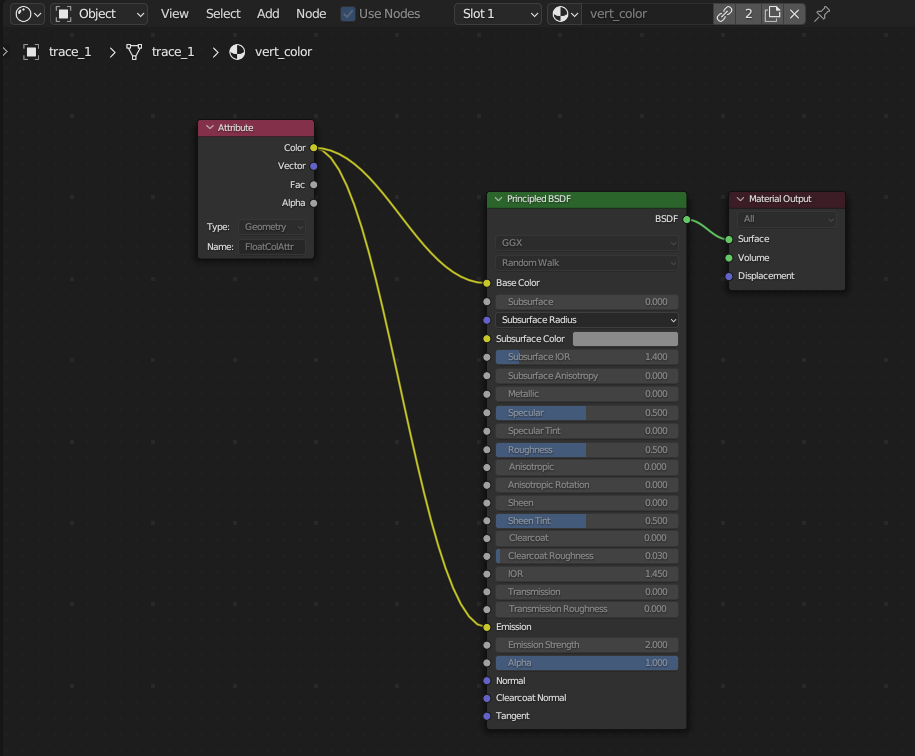

# Visualization Instructions

This page contains instructions on how I generate videos like the one below.
I'll assume you are familiar with Blender basics.


## Overview

**Exporting from Mujoco**.
We'll first roll out the diffusion policy in MuJoCo in an evaluation episode.
We'll densely (24 times a second -- the standard film rate 📽️) collect observations as well as poses of every single link (`body` in MuJoCo terms).
Then, we run diffusion policy for multiple seeds for each each observation, resulting in multiple action sequence predictions per frame.

**Importing to Blender**.
We'll first set up the static scene in Blender by manually importing the meshes and setting up all the lighting and materials.
Then each object is keyframed according to the recorded link's poses from the MuJoCo simulation.
Next, the end effector position sequences are imported as vertices only, and a custom geometry node setup will be used to efficiently instantiate a cube at every vertex position.
Finally, we'll use a shader (material) which renders the vertex colors.

> ❗ **Disclaimer**
> 
> If I were to do this visualization pipeline the *right* way, I would use bezier curves instead of instantiating a cube at every vertex position, since bezier curves also have a thickness option.
> This will increase rendering efficiency.
> I used the geometry node route because it was more fun for me, and life is too short to not do things the fun way 🐧

**Scope**:
My pipeline is optimized for rendering lots of videos in the same environment set up (same robot, same assets), with the most flexibility for visual customization in Blender.
This is why I opted for a manual scene set up in Blender to enable re-use of custom shader properties and camera tracks, instead of an automatic scene set up like in my [PyBullet Blender Renderer tool](https://github.com/huy-ha/pybullet-blender-recorder).
If a future project calls for it, I might look into making a repo which supports automatic MuJoCo scene imports.

## Installation & Setup


### Blender

Grab an installation of Blender that supports [Geometry Nodes](https://docs.blender.org/manual/en/latest/modeling/geometry_nodes/index.html).
I use version 3.6.
```shell
(base) 1 ❯ blender --version
Blender 3.6.1
        build date: 2023-07-17
        build time: 23:31:33
        build commit date: 2023-07-17
        build commit time: 12:50
        build hash: 8bda729ef4dc
        build platform: Linux
        build type: release
        build c flags:  -Wall -Werror=implicit-function-declaration -Werror=return-type -Werror=vla -Wstrict-prototypes -Wmissing-prototypes -Wno-char-subscripts -Wno-unknown-pragmas -Wpointer-arith -Wunused-parameter -Wwrite-strings -Wlogical-op -Wundef -Winit-self -Wmissing-include-dirs -Wno-div-by-zero -Wtype-limits -Wformat-signedness -Wrestrict -Wno-stringop-overread -Wno-stringop-overflow -Wnonnull -Wabsolute-value -Wuninitialized -Wredundant-decls -Wshadow -Wno-error=unused-but-set-variable -Wimplicit-fallthrough=5  -std=gnu11 -msse -pipe -fPIC -funsigned-char -fno-strict-aliasing -ffp-contract=off -msse2
        build c++ flags:  -Wuninitialized -Wredundant-decls -Wall -Wno-invalid-offsetof -Wno-sign-compare -Wlogical-op -Winit-self -Wmissing-include-dirs -Wno-div-by-zero -Wtype-limits -Werror=return-type -Wno-char-subscripts -Wno-unknown-pragmas -Wpointer-arith -Wunused-parameter -Wwrite-strings -Wundef -Wformat-signedness -Wrestrict -Wno-suggest-override -Wuninitialized -Wno-stringop-overread -Wno-stringop-overflow -Wundef -Wmissing-declarations -Wimplicit-fallthrough=5  -msse -pipe -fPIC -funsigned-char -fno-strict-aliasing -ffp-contract=off -msse2
        build link flags:  -Wl,--version-script='/home/blender/git/blender-v360/blender.git/source/creator/symbols_unix.map'
        build system: CMake
```

### Scaling Up

You can follow [setup](../docs/setup.md) instructions for my codebase, which will be used as an example in this tutorial.

### BlenderKit (Optional)

A game changer in my visualization workflow is BlenderKit, a free Blender add-on which provides an easy to use interface for materials, assets, and other goodies.
I use their materials in my visualizations (for instance, for the mailbox material above).
## Exporting from MuJoCo

The `Env` class (`scalingup/utils/core.py`) supports callbacks after each simulation step at a specified frequency.
In my code, it is used to render videos and collect observations at a specified framerate.
I use this functionality to register:
 - `anim_pose_callback`, which loops over every single body, records its pose, then dumps it into a pickle file.
 - `dense_obs_callbacks`, which records the observation at the current time. This is used to run the policy for multiple seeds per observation. Make sure `policy.set_seed(seed)` is set before running to allow seeded pseudo-randomness. The result of this is also dumped into a pickle file, for loading into blender.


## Importing to Blender

### Importing Animations

Correspondence between MuJoCo bodies and Blender objects is set manually with `object_mapper` in `scripts/import_blender_visualization.py`.
For the use case of rendering many videos of the same physical set up, this hacky solution works well.

In the script, `import_animation` just loops over every object, uses `object_mapper` to find the correspondences, then keyframes the recorded positions and orientations accordingly.

### Visualizing Traces

The first 3 dimensions of each action in an action sequence is the end effector position.
A single trace is created by densely interpolating between consecutive end effector positions, setting each vertex's color according to its order using the MatPlotLib jet colormap.

> 📘 **Note**
> 
> Blender comes with a separate python binary.
> To install `matplotlib` find the `pip` path for Blender's python, which is system dependent.
> On my Ubuntu system, I installed Blender using `snap` and I used the command
> ```sh
> /snap/blender/3822/3.6/python/bin/python3.10 -m pip install matplotlib
> ```

The result is a blender mesh object with vertices and vertex colors (stored in an attribute called `FloatColAttr`), and no edges/faces.
You can check that the mesh's data has the correct fields in the spreadsheet view



Since only faces are rendered, a mesh with only vertices are not visible by default.
This is where the geometry node set up comes in.



Reading the geometry node setup from left to right:
 - I take in the object's geometry data (which only has vertices), and instantiate a cube at each point. The result are instances, which share data over in the GPU and therefore render much more efficiently than separate objects.
 - I want to make sure each cube instance also contains the vertex color information we set for each point in the python script. To do this, I can access the named `FloatColAttr` attribute, and capture it at the instance level. This means when the cube instances are realized, they will share mesh data but store a copy of `FloatColAttr`, once per instance.

Almost every property you might care about can be keyframed in Blender.
To visualize the correct action traces in each frame, I just key frame the `hide_render` property to hide a frame index's traces on all other frames.

### Material Setup

The shader for the traces is extremely simple.
I want cubes to glow in the color that they have stored in `FloatColAttr`, so I can plug that attribute into base color and emission color.
You can tune the emission strength to your liking.

