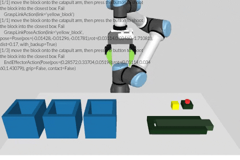
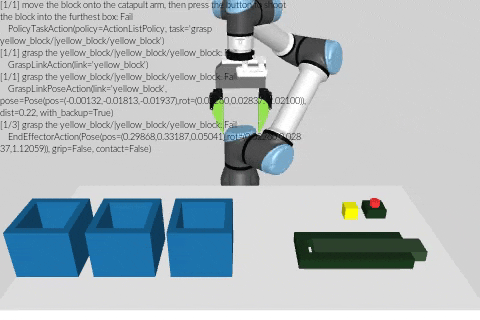
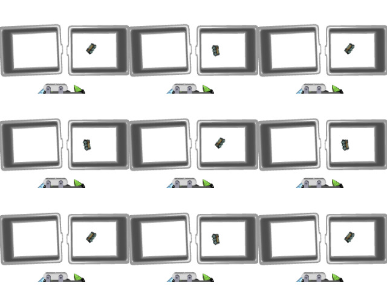
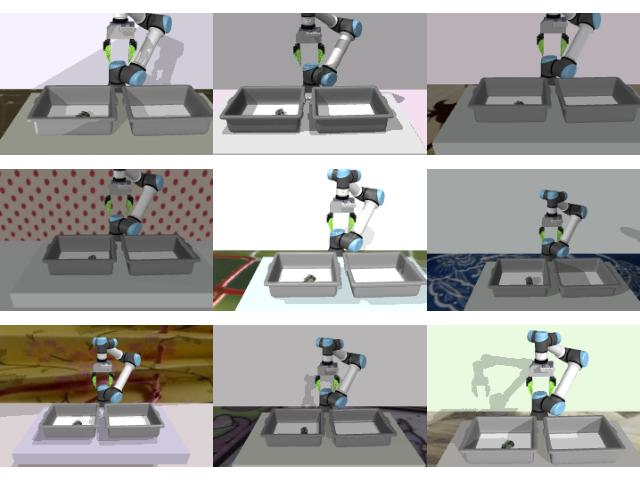

# Codebase Walkthrough


> 🙃 **Disclaimer**
> 
> In retrospect, I believe I made a suboptimal software architecture design choice.
> I only learned about [composition over inheritance](https://en.wikipedia.org/wiki/Composition_over_inheritance) during the later stages of the project.
> If I were to code everything from scratch again, I would opt for a less steep inheritance stack.

> 🙃 **Disclaimer** (but this time, I'm not apologetic about it)
> 
> **Non-conforming to OpenAI GYM API**. 
> To enable recursive subtrajectories within each trajectory rollout, the environment class does not conform to the OpenAI Gym API.
> For instance, there are no rewards.
> Otherwise, tasks would have to be an integral part of each environment, but it can change depending on which recursion level the agent's at, due to the nested nature of trajectories.

## 💡 Core Concepts

### 🪺 Nested Trajectories using Hierachical Actions and Policies

I group these three concepts together because there is no objectively good way to divide up what should be considered a task or a primitive action.
Should grasping be a task, requiring a trajectory of control actions to solve, or should grasping be a primitive, that can be combined and composed with picking primitives to solve re-arrangement tasks?

In this codebase, trajectories of "lower-level" actions can be nested within actions, and actions are in turn parts of a "higher-level" trajectory, allowing hierarchical definitions of actions.
Let's see an example (`examples/hierachical_actions.py`)
```py
from utils import set_up_env
from scalingup.utils.core import GraspLinkAction, EnvSampler, ActionListPolicy

"""
task sampler picks a random task in the domain, which is `catapult` in this case.
env sampler runs an environment with a policy and task to generate a trajectory.
"""
env, task_sampler, env_sampler_config = set_up_env("catapult")
env_sampler = EnvSampler(env=env, task_sampler=task_sampler)
# `policy` could be a diffusion policy, a language model, or simply a list of actions
# to be executed in an open loop manner
open_loop_grasp_action = GraspLinkAction(
    link_path="yellow_block/|yellow_block/yellow_block"
)
open_loop_grasp_policy = ActionListPolicy(actions=[open_loop_grasp_action])
env_sample = env_sampler.sample(
    episode_id=0,  # everything is fully-deterministic, using numpy random seeds
    policy=open_loop_grasp_policy,
    config=env_sampler_config,
)
trajectory = env_sample.trajectory
trajectory.dump_video(
    output_path="open_loop_grasp_block.mp4",
)
```

`open_loop_grasp_block.mp4` should look something like this



Two important things to note about this example:
- **Hierachical Actions**:
Looking at the text in the video, we see that at the top level, the policy was executing a `GraspLinkAction(link="yellow_block")` action.
`GraspLinkAction` actions are grasp sampler actions, whose goal is to find a grasp pose to grasp `link_path`.
Thus, `GraspLinkAction` compiles down to the lower-level action type `GraspLinkPoseAction`, whose goal is to grasp `link_path` at the grasp pose `pose`.
For instance, in this example, `GraspLinkAction` found the pose with position `(-0.014, -0.013, -0.018)` and orientation `(0.03, 0.03, -1.71)` relative to the yellow cube, and used these parameters to construct a `GraspLinkPoseAction` object.
In turn, the `GraspLinkPoseAction` compiles down to a sequence of `EndEffectorAction` commands, corresponding to the pre-grasp, grasp, and post-grasp action commands.
Finally, `EndEffectorAction` each compiles down to a sequence of `ControlAction`.
 - **Unsuccessful Actions**:
The open loop grasp action above was unsuccessful.
This is because all primitives provided in this code base are *exploration primitives*, which produce diverse attempts at the task.
They were designed for data generation, not robust execution.


> 🤔 **Question**
> 
> Why is `link_path` so long? 
>
> All MuJoCo environments in this codebase are constructed dynamically using [`dm_control`'s MJCF](https://github.com/deepmind/dm_control/tree/main/dm_control/mjcf), which prefixes each MuJoCo body's name (e.g., "yellow_block") with the original XML file's model name (also "yellow_block" in this example, yielding "yellow_block/yellow_block").
> On top of this, my codebase concatenates the full path from the root body, which helps with disambiguating parts with the same names of different MuJoCo bodies (i.e., `handle` of `top_drawer` v.s. `bottom_drawer`).
> These long names are only used in the backend -- the language model and you will likely only ever see the output from the `LanguageStateEncoder` which looks something like this
> ```
> scene:                                                                     
> - catapult                                                                 
>    + button                                                                
>    + catapult arm                                                          
> - yellow block                                                             
> - closest box                                                              
> - furthest box                                                             
> - middle box                                                               
> - table 
> ```


Open Loop actions are actions whose termination does not depend on the environment state.
`GraspLinkAction`, `EndEffectorAction`, and `ControlAction` are examples of open loop actions.
One of our core codebase design decisions is to make no distinction between a closed-loop action and a policy trying to accomplish a task.
Namely, a closed-loop action is an open-loop policy that repeatedly retries a sequence of lower-level actions until its current task is successful.
Let's make a closed-loop grasping action using our previous open-loop grasping policy.
```py
closed_loop_grasp_action = PolicyTaskAction(
    policy=open_loop_grasp_policy,
    retry_until_success=True,
    task=GraspObj(link_path="yellow_block/|yellow_block/yellow_block"),
)
env_sample = env_sampler.sample(
    episode_id=0,  # everything is fully-deterministic, using numpy random seeds
    policy=closed_loop_grasp_action,
    config=env_sampler_config,
)
trajectory = env_sample.trajectory
trajectory.dump_video(
    output_path="closed_loop_grasp_block.mp4",
)
```
`closed_loop_grasp_block.mp4` should look something like this



This is much better.
While the first few grasp attempts was not successful, the policy robustly retries until it succeeds.
This is enabled by the most important action type in this codebase, the `PolicyTaskAction`.
```py
@dataclasses.dataclass(frozen=True)
class PolicyTaskAction(SubtrajectoryAction):
    policy: Policy
    task: Task
    retry_until_success: bool
```
If `retry_until_success` is true, this action will run `policy` (which can be an list of actions, a diffusion policy, a language model policy, anything!) until `task` succeeds.
By getting a language model to output the success condition for `task`, we get the core logic of Verify & Retry from our paper.


> 💡 **Tip**
> 
> If you want to use a real-time GUI viewer, you can use MuJoCo's live viewer, as demonstrated in [`examples/hierachical_actions.py`](https://github.com/real-stanford/scalingup/blob/master/examples/hierachical_actions.py)
> 

### Exploration Task Tree

Our approach recursively predicts subtasks/actions (recall, they mean similar things in this codebase) and task success code snippets.
This functionality is all implemented in `scalingup/policy/llm_policy_utils.py`.
Here, we'll walk through the example in `examples/exploration_task_tree.py` on how to use it (make sure you set up the [LLM API key or use my cached responses](#language-model-queries))
```py
datagen_policy = set_up_policy(policy_config_name="scalingup")
env, task_sampler, env_sampler_config = set_up_env("drawer")
obs = env.reset(episode_id=0)
task = task_sampler.sample(obs=obs, seed=0)
# state encoder simply parses through the env state to output a
# bullet list of objects and the articulation structure so the
# llm knows which objects (parts) are in the scene and how they
# are connected
context, context_name_to_link_path = datagen_policy.state_encoder(obs.state)
# this is the part where the LLM is used to recursively infer the
# exploration task tree
task_tree = datagen_policy.task_tree_inference(
    query=task.desc,
    context=context,
    state=obs.state,
    context_name_to_link_path=context_name_to_link_path,
)
rich.print(task_tree)
```
Mostly similar to the above example, but instead of using a simple `ActionListPolicy`, we use our data generation policy.
Running this code should output
```py
TaskTreeNode(
    task=Task(desc='move the purple pencilcase into the bottom drawer'),
    children=[
        ActionTreeNode(
            task=Task(desc='open the bottom drawer'),
            children=[],
            retry_until_success=True,
            policy=ActionListPolicy(
                actions=[
                    PolicyTaskAction(
                        policy=ActionListPolicy(
                            actions=[GraspLinkAction(link_path='drawer/|drawer/drawer|drawer/bottom_drawer|drawer/bottom_drawer_handle', with_backup=False, top_down_grasp_bias=0.0001, pushin_more=True, action_primitive_mode=False)]
                        ),
                        task=Task(desc='grasp the bottom_drawer_handle'),
                        retry_until_success=True
                    ),
                    PrismaticJointAction(link_path='drawer/|drawer/drawer|drawer/bottom_drawer|drawer/bottom_drawer_handle', towards_max=True)
                ]
            )
        ),
        ActionTreeNode(
            task=Task(desc='with the bottom drawer opened, move the purple pencilcase into the bottom drawer'),
            children=[],
            retry_until_success=True,
            policy=ActionListPolicy(
                actions=[
                    PolicyTaskAction(
                        policy=ActionListPolicy(actions=[GraspLinkAction(link_path='purple pencilcase/|purple pencilcase/purple pencilcase', with_backup=True, top_down_grasp_bias=0.0001, pushin_more=True, action_primitive_mode=False)]),
                        task=Task(desc='grasp the purple pencilcase'),
                        retry_until_success=True
                    ),
                    PlaceOnLinkAction(link_path='drawer/|drawer/drawer|drawer/bottom_drawer', action_primitive_mode=False)
                ]
            )
        ),
        ActionTreeNode(
            task=Task(desc='with the purple pencilcase in the bottom drawer, close the bottom drawer'),
            children=[],
            retry_until_success=True,
            policy=ActionListPolicy(
                actions=[
                    PolicyTaskAction(
                        policy=ActionListPolicy(
                            actions=[GraspLinkAction(link_path='drawer/|drawer/drawer|drawer/bottom_drawer|drawer/bottom_drawer_handle', with_backup=False, top_down_grasp_bias=0.0001, pushin_more=True, action_primitive_mode=False)]
                        ),
                        task=Task(desc='grasp the bottom_drawer_handle'),
                        retry_until_success=True
                    ),
                    PrismaticJointAction(link_path='drawer/|drawer/drawer|drawer/bottom_drawer|drawer/bottom_drawer_handle', towards_max=False)
                ]
            )
        )
    ],
    retry_until_success=True
)
```

The exploration task tree tells the policy to perform a sequence of subtasks (e.g., `grasp the bottom drawer handle`, etc.) to solve the root task (`move the purple pencilcase into the bottom drawer`).
`TaskTreeNode`s can contain other instances of `TaskTreeNodes`, thus supporting recursion.
Finally, all actions are performed in a closed-loop manner using `PolicyTaskAction`s introduced above.

Like `ActionListPolicy`, `datagen_policy` is just a policy that can be passed into `EnvSampler` to get a trajectory out.
```py
env_sampler = EnvSampler(env=env, task_sampler=task_sampler)
env_sample = env_sampler.sample(
    episode_id=0,
    policy=datagen_policy,
    config=env_sampler_config,
)
env_sample.trajectory.dump_video(
    output_path="exploration_task_tree.mp4",
)
```

which should output a video like this


### 🌈 Seeded Variation

Rolling out a policy to generate a trajectory has multiple sources of variations.
They are seeded and handled by separate numpy states when the environment's `episode_id` is set
```py
@episode_id.setter
def episode_id(self, episode_id: int):
    self._episode_id = episode_id
    # random states for internal use in this codebase
    self.pose_numpy_random = np.random.RandomState(
        seed=self._episode_id
        if self.num_pose_variations is None
        else self._episode_id % self.num_pose_variations
    )
    self.setup_numpy_random = np.random.RandomState(
        seed=self._episode_id
        if self.num_setup_variations is None
        else self._episode_id % self.num_setup_variations
    )
    self.visual_numpy_random = np.random.RandomState(
        seed=self._episode_id
        if self.num_visual_variations is None
        else self._episode_id % self.num_visual_variations
    )
    self.policy_numpy_random = np.random.RandomState(seed=self._episode_id)
    self.rrt_numpy_random = np.random.RandomState(seed=self._episode_id)
    self.task_numpy_random = np.random.RandomState(seed=self._episode_id)
    # seed globally as well, when external libraries do not 
    # expose their random states
    np.random.seed(self._episode_id)
    random.seed(self._episode_id)
    torch.manual_seed(self._episode_id)
```
Each of the random states are responsible for the following:
 - `setup_numpy_random`: controls which objects are chosen to be included in the scene (e.g., used in the transport domain)
 - `pose_numpy_random`: controls where these objects appear in the scene
 - `visual_numpy_random`: controls domain randomization.
 - `policy_numpy_random`: controls policy randomness, via the `EnvSampler`. This allows pseudo-random policies (e.g., diffusion policy, exploration policy) to be controlled by the environment's episode as well.
 - `rrt_numpy_random`: controls random sampling in motion planning.
 - `task_numpy_random`: controls random sampling of tasks within a domain.

The modulo operator within the random state constructor allows you to set an exact number of variations.
To follow the example in `examples/seeded_variation.py`, if you want exactly 2 pose variations and 1 object 
```py
env = set_up_env("bin_transport_train")[0]
env.num_pose_variations = 2
env.num_setup_variations = 1
images = [env.reset(episode_id=i).images["top_down"].rgb for i in range(9)]
# then show images
...
```

Which should load in only one object, in one of two random poses



Similarly, you can enable domain randomization
```py
env = set_up_env(
    "bin_transport_train",
    extra_overrides=[
        "env/domain_rand_config=all",
        # use full path to help MuJoCo find assets
        # p.s., `yaki` is shuran's cat 🐈
        "env.domain_rand_config.dtd_root=/home/yaki/scalingup/dtd/",
    ],
)[0]
env.num_pose_variations = 2
env.num_setup_variations = 1
images = [env.reset(episode_id=i).images["front"].rgb for i in range(9)]
# then show images
...
```


##  Control

### Control Buffer

Environments are instantiated with control buffers, which contain time-stamped control values.
A timestamp of `t` seconds with a position control value `x` means the robot should *finish reaching* to configuration `x` at time `t`.
When control values are sent a regular interval `dt`, this usually means the robot should *start reaching* for configuration `x` at time `t-dt`.

The control buffer is responsible for converting between end effector control formats and joint control formats and interpolating between control values.
It will use linear interpolation for joint and 3D cartesian positions, and spherical interpolation for rotations.

### 🫳 End Effector Control

Ideally, we would use a nice operational space control (OSC) set up.
Currently, to handle end effector control, we just run repeated IK.
This can be quite costly, and extending the codebase to support OSC would help with wall clock efficiency (see my notes on [profiling](extend.md#profiling-⏱️)).

## 🏃‍♂️ Motion Planning

**Computing a plan**.
The grasp-aware motion planner will check whether the robot is grasping an object or not, and plan accordingly.
It assumes the grasp is rigid, and forward kinematics the grasped objects using this rigid grasp pose so that it can account for the object's collisions as well.
In practice, the rigid grasp assumption doesn't perfectly hold, since the grasped object will likely slip at least a tiny bit during execution.
However, the better the grasp, the less it will slip.
To improve efficiency, I added a few different types of `RRTSampler`, which allows to add initial samples to guide or bias RRT sampling.
For this project, I bias the sampling near the current and goal configuration, which I found gave qualitatively better plans (robot is less likely to move weirdly).

**Smoothing a plan**.
Plans look better after some `smoothing`.
However, if you smooth the plan too much, the robot can move too close to another object, where slight inaccuracies (due to the interpolation control handler) or friction slips (due to suboptimal object grasps) causes the robot or its grasped objects to bump into other objects.
I found `100` smoothing iterations to be a good trade-off.

**Following a plan**.
The plan is simplified, rescaled to account for velocity limits, and converted into time-stamped controls before sending over to the control buffer.
Since the plan accounts for grasped objects, following such a plan should account for grasped objects too.
Namely, if grasped objects slip out and fall mid-way through following a plan, the environment will raise a `Action.DroppedGraspedObj` exception.
This will stop the robot and replan.

## Language Model Queries

### 💿 Cache

You can download a cache of all the language model completions I used in my project from the project's website
```sh
wget https://www.cs.columbia.edu/~huy/scalingup/static/responses.zip
```

These are just pickled responses from the OpenAI API.
Make sure you unzip them to a folder called `responses` under the package directory `scalingup/`.

Alternatively, if you don't want to use the cache, then set the `OPENAI_API_KEY` to your secret.

### 🔗 Linking LLM Modules Together

As described in the paper appendix, our LLM pipeline involves multiple modules.
Each module has a small and well-defined responsibility, which, in my experience, has a few benefits:
 - *Easy to Extend and Maintain*: It's typical to work on toy problems early on in each project, then scale up (pun intended) complexity towards the end. I've found that as I did this, adding more modules and modifying existing ones lead to much less time prompt engineering than the monolithic prompt approach.
 - *Better Performance*: Since each LLM has such a small role, you can provide many in-context examples for few shot prompt, which leads to better performance.
 - *Economical Token Usage*: Compared to a monolithic prompt, having modules with a single responsibility that requires short answers allows to to save on token usage. Most of our modules have a max token limit of 256, some uses 16, and one of the modules uses 0 (we only care about the log probabilities of the prompt tokens).
 - *High Cache Hit Ratios*: When another module's prompts get update, I've observed that other module's inputs & outputs remain the same, so their outputs can be fetched from cache. This results in a further savings on token usage.

All prompts can be found under `scalingup/prompts` and the config YAML for our language-guided data generation policy can be found at `scalingup/config/policy/task_tree_inference/divide_and_conquer.yaml`.
As you can see from the version numbers of the prompts, I've only made a few iterations for most LLM modules.


### 🪙 Coin flips 


I originally intended for the LLM to do exploration in the language space, such that it can sample different plans proportional to their completion probabilities.
Quickly, it became obvious that the bottleneck was low-level exploration, not language-based common sense planning.

However, now I have a fun LLM coin flip test which shows how "biased" LLMs can be 😝
```
> python tests/test_openai_branch.py
╭───────────────────╮ ╭───────────────────╮ ╭───────────────────╮ ╭───────────────────╮
│ # logprob = -0.16 │ │ # logprob = -3.45 │ │ # logprob = -8.70 │ │ # logprob = -2.21 │
│ - 4. Heads.       │ │ - 4. Heads.       │ │ - 4. Tails.       │ │ - 4. Tails.       │
│ - 5. Tails.       │ │ - 5. Heads.       │ │ - 5. Tails.       │ │ - 5. Heads.       │
╰───────────────────╯ ╰───────────────────╯ ╰───────────────────╯ ╰───────────────────╯
```